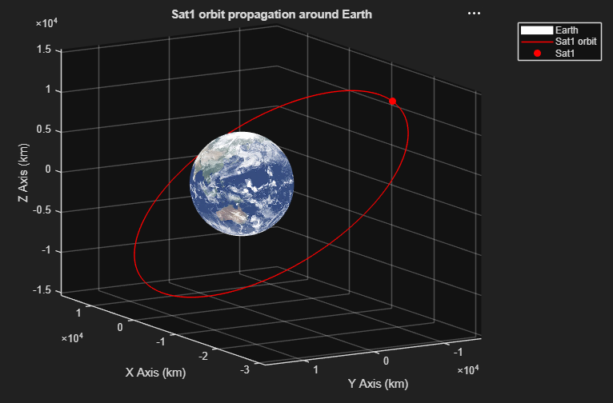
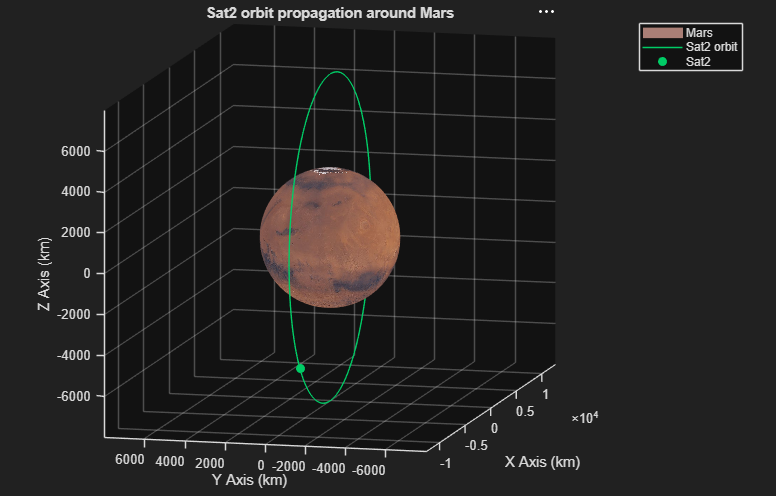
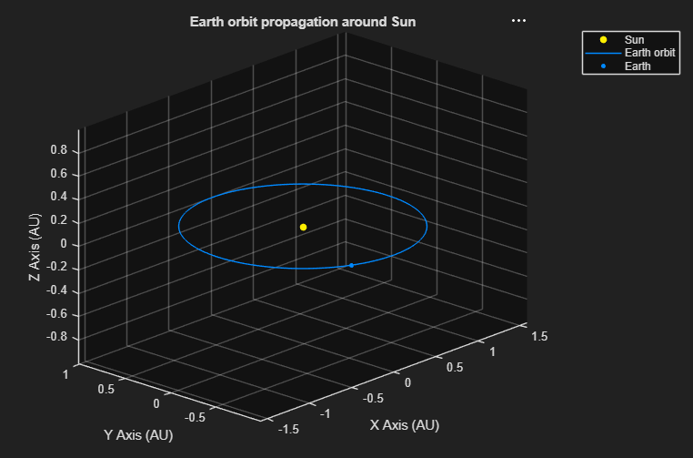
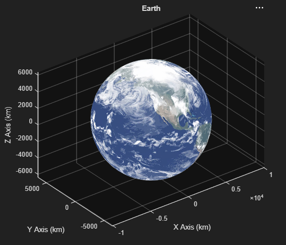

## OrbitToolkit
**Developer:** Omoniyi Bankole   
**Date Last Revised:** 10/03/2026  
**Completion Status:** Core two-body propagation complete; multibody and maneuver features in development   

### Purpose
**OrbitToolkit** is a MATLAB-based orbit propagator tool used to solve the classical mechanics two-body problem, enabling the 
visualization of keplerian orbits around a central body.  

The tool uses a object-oriented programming approach to define 3 classes:  
`Satellite` - An object in orbit around a central body  
`CelestialBody` -  An object that acts as a central body, but inherits the methods of the `Satellite` class  
`System` - A system with one central body and multiple objects in orbit around it.  

**Note:** `System` class still in development

### Package Structure
- OrbitToolkit
    - Classes (Satellite, CelestialBody, and System .m files)
    - Setup (Load solar system celestial bodies to workspace) 
    - Textures (Surface textures for 3D rendering)
    - Propagation (Two-body propagator and related math functions)
    - OrbitToolkit.prj (MATLAB project file, enables proper path loading on startup)
    - README.md (This file)


## Tool Usage 
### Defining a Satellite
A `Satellite` object's orbit is defined using its Keplerian orbital elements around its central body. 

`Satellite` class properties:
- Name (name), Satellite's name
- Semi-major axis (sma), units in km 
- Eccentricity (ecc)
- Inclination (inc), units in degrees
- Right ascension of ascending node (raan), units in degrees
- Argument of periapsis (argp), units in degrees
- True anomaly (nu), units in degrees
- Central body (cenbody), `CelestialBody` object
- Propagation time (proptime), units in seconds
- Propagation time step (propstep), units in seconds
- Orbit color (orbitcolor), HEX color code or built-in MATLAB colors
- Marker color (markercolor), HEX color code or built-in MATLAB colors

To create a Satellite, the following approach is used:  
```
% In Command Window

% Earth and Mars must be defined in workspace before creating Satellite objects

% Satellite trajectory color defined with MATLAB built-in color string
Sat1 = Satellite("Sat1", 20e3, 0.35, 35, 0, 0, 0, Earth, 50e3, 10, 'r', 'r');

% Satellite trajectory color defined with HEX color code
Sat2 = Satellite("Sat2", 8e3, 0, 90, 0, 0, 0, Mars, 30e3, 10, "#00CC66", "#00CC66");
```
### Propagating a Satellite orbit
Once a `Satellite` object has been defined, its orbit can be visualized in 3D using the **propagate** method.

```
% In Command Window

Sat1.propagate
Sat2.propagate
```
  
**Figure 1.** Sat1's orbit around Earth  


**Figure 2.** Sat2's orbit around Mars  


### Defining a CelestialBody 
A `CelestialBody` object inherits the properties of the `Satellite` class, effectively acting as an object in orbit around its respective central body (e.g. Earth is in orbit around the Sun).  
Stars, planets, moons, and asteroids can be created as `CelestialBody` objects, allowing for `Satellite` orbits to be propagated around them.

`CelestialBody` non-inherited properties:
- Gravitational parameter (mu), units in km^3/s^2
- Mean radius (radius), units in km
- Surface texture (texture), .jpg or .png file of surface texture  

**Note:** In order to properly render surface texture, the image files **must** exist in the Images/Textures folder.


To create a central body that a `Satellite` can orbit around, the following approaches can be used:
  
1.) Define a `Sattelite` first, then call it as a `CelestialBody`
``` 
% In Command Window 

Earth = Satellite(...); % Define its own orbital elements around its central body
Earth = CelestialBody(3.986e5, 6378, "Earth.jpg", Earth); 
```

2.) Define a default `CelestialBody` then modify properties
```
% In Command Window

Asteroid = CelestialBody(); % Creates default celestial body
Asteroid.name = "Asteroid 1";
Asteroid.mu = 123456;
Asteroid.radius = 1234;
Asteroid.texture = "Asteroid.jpg";

% Enables quick creation of celestial bodies if its own orbital parameters aren't needed
```

3.) Load the Solar System celestial bodies via the Planets.mat file 
```
% In Command Window

load("Planets.mat"); % loads the Sun and planets in the solar system to workspace

% 9 Pre-defined Celestial Bodies:
% Sun, Mercury, Venus, Earth, Mars, Jupiter, Saturn, Uranus, Neptune
```

4.) Load individual celestial bodies with unique `create` functions
```
% In Command Window

Sun = createSun();
Earth = createEarth();
Mercury = createMercury();
``` 
### Propagating a CelestialBody orbit
Once a `CelestialBody` object has been defined, its orbit can be visualized in 3D using the **propagate** method.
Additionally, a `CelestialBody` can call the **view** method to render object in 3D

```
% In Command Window

Earth.propagate
Earth.view
```
  
**Figure 3.** Earth's orbit around the Sun  
 

**Figure 4.** 3D render of Earth   


### Defining a System
A `System` object is intended to hold multiple `Satellite` objects around a shared `CelestialBody`. While still in development, this class is intended to allow 
for more advanced orbit propagation and mission design capability.

`System` class properties:
- Central Body (centralBody), `CelestialBody` object
- Satellites (sats), Array of `Satellite` objects
- Celestial Bodies (celesbodies), Array of `CelestialBody` objects

To create a system, the following approaches can be used:  
1.) Define a `System` of satellites around a central body (e.g. GPS constellation)
```
% In Command Window

Earth = createEarth()
Sats = [Sat1,Sat2,Sat3,Sat4];

GPS_Constellation = System(Earth, Sats, []);
```

2.) Define a `System` of celestial bodies around a central body (solar system)
```
% In Command Window

Sun = createSun();
Mercury = createMercury();
Venus = createVenus();
Earth = createEarth();
Mars = createMars();
Inner_planets = [Mercury, Venus, Earth, Mars];

Solar_system = System(Sun, [], Inner_planets);
```
## Future Work
In order to further advance the capability of **OrbitToolkit**, the following functionality will be implemented.

1.) Multibody propagation

- `System` method for propagating all `Satellite` or `CelestialBody` orbits around a central body
- Enables visualization of multiple orbits

2.) Orbital maneuvers
- Mission design functionality to calculate and visualize orbital maneuver burns (Hohmann transfer and Plane change burns)  
- Enables orbit visualization and delta V estimates for maneuvers
 
3.) Interplanetary transfers
- Mission design functionality to calculate and visualize interplanetary transfer burns (Lamberts problem)
- Enables orbit visualization and delta V estimates for interplanetary trajectories